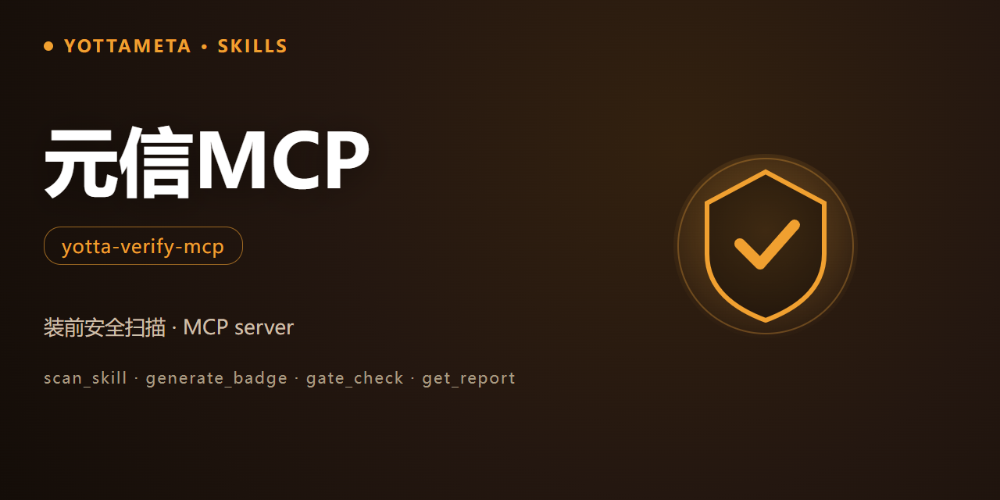

<p align="center"><b>Language</b>: English · <a href="./README.zh-CN.md">中文</a></p>

<p align="center">
  
</p>

<h1 align="center">yotta-verify-mcp · 元信MCP (YuanXin MCP)</h1>

<p align="center">YottaMeta's <b>pre-install security scanner for Agent skills</b>, exposed as a
stdio MCP server. Before you install any skill, plugin or MCP server, it runs a
<b>deterministic static scan</b> — prompt injection, malicious patterns, SKILL.md integrity and
permissions — and returns a <b>verdict</b>, an <b>audited badge</b>, a CI <b>gate</b> and a
<b>report</b> as MCP tools.</p>
<p align="center">Activates when configuring the 元信 MCP server in an MCP client, wiring a
trust-scan into an agent / workflow, or calling the MCP tools.</p>
<p align="center">Zero dependencies (Python 3.8+ standard library); Windows + Linux + macOS; fully
local and offline — no network calls, no execution of the scanned code.</p>

<p align="center">
  <a href="LICENSE"></a>
  <a href="https://agentskills.io/"></a>
  <a href="https://www.npmjs.com/package/@yottameta/yotta-verify-mcp"></a>
  <a href="https://github.com/YottaMeta/yotta-verify-mcp"></a>
  <a href="https://github.com/YottaMeta/yotta-verify-mcp/commits/main"></a>
  <a href="https://github.com/YottaMeta/yotta-verify-mcp"></a>
</p>

## What it is

The skill / plugin market has a trust problem: a 2025 survey of 22,511 skills found 140,963 issues,
and **36% contain prompt injection**. 元信 MCP gives you a <b>deterministic answer before you
install</b> — the same scan as the [yotta-verify](https://github.com/YottaMeta/yotta-verify) CLI,
exposed as four MCP tools so any MCP client (Claude, VS Code, Codex, Cursor, …) can call it.

It is a <b>pre-install verifier</b>, not a sandbox and not a runtime monitor: it only reads files
and prints a report. It never executes the scanned code, never connects to the network for the scan,
and never fixes anything.

## Why use it

| Advantage | Description |
|---|---|
| **Trust before install** | A deterministic verdict for any skill / MCP server, instead of "trust me" |
| **Zero dependency** | Python 3.8+ standard library; no daemon / database / network |
| **Fully local offline** | Scans directories and npm tarballs on disk; nothing is executed or uploaded |
| **Drop into any MCP client** | Standard stdio MCP server — configure the server, and the four tools appear |
| **Family synergy** | Same rules table as yotta-verify (single source); verdicts merge with yotta-vetter / yotta-security-audit |
| **Free & open** | MIT; the whole scanner is free |

## MCP tools

| Tool | What it does |
|---|---|
| `scan_skill` | Pre-install scan: `target` (dir / .tgz / npm package) → verdict + severity counts + findings |
| `generate_badge` | Audited badge: local SVG + shields.io URL; folds in validate / vetter / audit / version / tests |
| `gate_check` | CI gate: fail when the worst severity exceeds `max_severity` (default medium) |
| `get_report` | Verification report: Markdown or JSON, same format as the CLI |

## MCP client configuration

You usually do not need to write the `mcpServers` entry yourself: after installing this skill, an AI agent auto-adds the `yotta-verify-mcp` entry per the「AI 自动接入」section in `SKILL.md`, and falls back to the CLI scanner when MCP tools are unavailable.

## Tool reference

### `scan_skill`

Scan a skill directory or package before install.

| Param | Type | Required | Meaning |
|---|---|---|---|
| `target` | string | yes | Skill directory path, `.tgz` / `.tar.gz` path, or npm package name (auto `npm pack` to a temp dir, then scan) |

Returns a JSON result: verdict, severity counts, and findings (prompt injection / malicious
patterns / SKILL.md integrity).

### `generate_badge`

Generate an audited badge (local SVG + shields.io URL).

| Param | Type | Meaning |
|---|---|---|
| `target` | string | Optional: scan this to derive the verdict |
| `verdict` | string | Optional: set the verdict directly |
| `validate` | string | Optional: `pass` / `fail` (validate-skill result) |
| `vetter` / `audit` | string | Optional: external verdicts to fold in |
| `version` | string | Optional: version label. Defaults to the <b>scanner (yotta-verify) version</b> (e.g. 0.1.1) |
| `tests` | integer | Optional: engine test count |
| `out` | string | Optional: write the SVG to this path |

> Note: the badge's `version` segment reflects the version of the <b>scanning engine</b>
> (yotta-verify), not the MCP package (0.1.4). Pass `version` to override.

### `gate_check`

CI pre-install gate.

| Param | Type | Meaning |
|---|---|---|
| `target` | string | Required: dir / package to scan |
| `max_severity` | string | Optional: `info` / `low` / `medium` / `high` / `critical` (default `medium`) |

Returns `pass`, `verdict`, `worst`, `max_severity` and an exit `code`.

### `get_report`

Generate a verification report.

| Param | Type | Meaning |
|---|---|---|
| `target` | string | Required: dir / package to scan |
| `format` | string | Optional: `json` / `markdown` (default `markdown`) |
| `out` | string | Optional: write the report to this path |

## Boundary

This is a **local, offline, static** scan:

- **Directory scan** is fully offline — content never leaves your machine.
- **npm package scan** only downloads the public package into a temporary directory (then removes it);
  it does not upload your content and does not execute the scanned package code.
- It does **not** perform dynamic analysis, does **not** fix anything, and does **not** make the final
  decision. Treat the verdict as a strong signal and confirm any "install / don't install" decision
  yourself.
- Only scan targets you are authorised to evaluate.

## Installation of the skill

The package also ships a `SKILL.md` so an agent can learn how to configure and use the MCP server.
Pick any of the four methods below (skill files come from **npm**; GitHub can be slow without a proxy).

### Method 1: npm one-liner (recommended)

```text
# Optional China mirror: npm config set registry https://registry.npmmirror.com
npx -y @yottameta/yotta-verify-mcp --agent <agent-name>      # install to the agent's default user-level skills dir
npx -y @yottameta/yotta-verify-mcp --dir <your-skills-dir>   # point to the skills dir itself (e.g. ~/.codex/skills)
```

- `--agent <name>` installs to that agent's default user-level directory; `--list` shows each agent's default directory.
- `--dir <path>` installs to the given directory.
- The installer also starts an MCP server when run with no arguments: `npx -y @yottameta/yotta-verify-mcp`.

### Method 2: git clone (developers / git available)

```text
git clone https://github.com/YottaMeta/yotta-verify-mcp.git <your-skills-dir>/yotta-verify-mcp
```

### Method 3: GitHub Download ZIP (manual / no git)

On the GitHub repository `YottaMeta/yotta-verify-mcp`, click **Code → Download ZIP**, unzip it and put
the `yotta-verify-mcp` folder into the agent's skills directory.

### Method 4: install.sh (multi-agent one-liner script)

```text
bash install.sh --agent <name>   # install to the agent's default user-level directory
bash install.sh --dir <path>     # install to the given directory
bash install.sh --list           # list agents -> default directories
```

## Development & validation

The package ships its own test suite (included in the published package):

```bash
# Run the full suite (32 cases) from the skill directory (Python 3.8 / 3.13 both green)
python scripts/test_yotta_verify_mcp.py

# Run the MCP server directly for debugging
python scripts/yotta_verify_mcp.py
```

References: `references/trust-checklist.md` (pre-install trust checklist for MCP servers / plugins).

## License

MIT © YottaMeta — see [LICENSE](./LICENSE).
